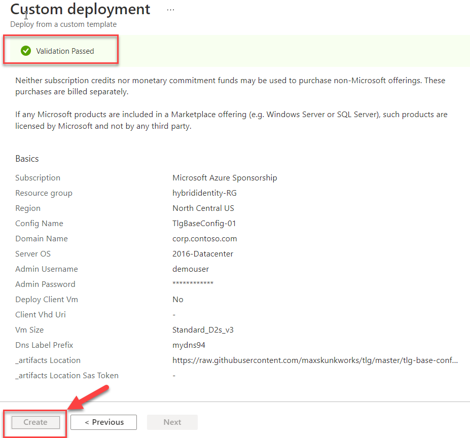

<div class="MCWHeader1">
Hybrid identity
</div>

<div class="MCWHeader2">
Before the hands-on lab setup guide
</div>

<div class="MCWHeader3">
May 2022
</div>

Information in this document, including URL and other Internet Web site references, is subject to change without notice. Unless otherwise noted, the example companies, organizations, products, domain names, e-mail addresses, logos, people, places, and events depicted herein are fictitious, and no association with any real company, organization, product, domain name, e-mail address, logo, person, place or event is intended or should be inferred. Complying with all applicable copyright laws is the responsibility of the user. Without limiting the rights under copyright, no part of this document may be reproduced, stored in or introduced into a retrieval system, or transmitted in any form or by any means (electronic, mechanical, photocopying, recording, or otherwise), or for any purpose, without the express written permission of Microsoft Corporation.

Microsoft may have patents, patent applications, trademarks, copyrights, or other intellectual property rights covering subject matter in this document. Except as expressly provided in any written license agreement from Microsoft, the furnishing of this document does not give you any license to these patents, trademarks, copyrights, or other intellectual property.

The names of manufacturers, products, or URLs are provided for informational purposes only and Microsoft makes no representations and warranties, either expressed, implied, or statutory, regarding these manufacturers or the use of the products with any Microsoft technologies. The inclusion of a manufacturer or product does not imply endorsement of Microsoft of the manufacturer or product. Links may be provided to third party sites. Such sites are not under the control of Microsoft and Microsoft is not responsible for the contents of any linked site or any link contained in a linked site, or any changes or updates to such sites. Microsoft is not responsible for webcasting or any other form of transmission received from any linked site. Microsoft is providing these links to you only as a convenience, and the inclusion of any link does not imply endorsement of Microsoft of the site or the products contained therein.

© 2022 Microsoft Corporation. All rights reserved.

Microsoft and the trademarks listed at <https://www.microsoft.com/en-us/legal/intellectualproperty/Trademarks/Usage/General.aspx> are trademarks of the Microsoft group of companies. All other trademarks are property of their respective owners.

**Contents**

<!-- TOC -->

- [Hybrid identity before the hands-on lab setup guide](#hybrid-identity-before-the-hands-on-lab-setup-guide)
  - [Requirements](#requirements)
  - [Before the hands-on lab](#before-the-hands-on-lab)
    - [Task 1: Review the relevant Microsoft documentation](#task-1-review-the-relevant-microsoft-documentation)
    - [Task 2: Validate the role in the Azure subscription](#task-2-validate-the-role-in-the-azure-subscription)
    - [Task 3: Review the type of subscription](#task-3-review-the-type-of-subscription)
    - [Task 4: Deploy the lab environment Azure VMs](#task-4-deploy-the-lab-environment-azure-vms)
    - [Task 5: Configure the lab environment Azure VMs](#task-5-configure-the-lab-environment-azure-vms)
    - [Task 6: Restart the Azure VMs](#task-6-restart-the-azure-vms)
    - [Task 7: Configure contoso.local Active Directory](#task-7-configure-contosolocal-active-directory)

<!-- /TOC -->

# Hybrid identity before the hands-on lab setup guide

## Requirements

- A Microsoft Azure subscription with at least 16 vCPUs available in the Azure region where the Azure VMs deployed in this lab will reside.

  - DC1 and APP1 VMs -- 2 x D8s\_v3: 2 x 8 vCPUs = 16 vCPUs

- A Microsoft account with the owner or the contributor role in the Azure subscription

   > **Note**: The lab computer does not require locally installed software.

## Before the hands-on lab

Timeframe: 150 minutes

### Task 1: Review the relevant Microsoft documentation

1. Review online documentation regarding Azure Active Directory at <https://docs.microsoft.com/en-us/azure/active-directory/> focusing on its integration with Active Directory and its B2B capabilities.

### Task 2: Validate the role in the Azure subscription

1. Log in to the Azure portal at <http://portal.azure.com>, and select  **All services**. Then search for and select **Subscriptions**.

     

2. On the **Subscriptions** blade, select the name of the subscription you intend to use for this lab.

3. On the subscription blade, select **Access control (IAM)**.

4. Review the list of user accounts, and verify that your user account has the Owner or Contributor role assigned.

### Task 3: Review the type of subscription

1. Navigate to the subscription you're going to use and select **Overview** in the subscription blade.

2. Review the **Offer** and compare it with the list found at: <https://azure.microsoft.com/en-us/support/legal/offer-details/>. Make sure that the offer doesn't have a spending limit on it. Subscriptions with spending limits will be unable to complete all the steps of the lab.

    

### Task 4: Deploy the lab environment Azure VMs

1. In the browser window displaying the Azure portal, navigate to: <https://github.com/maxskunkworks/TLG/tree/master/tlg-base-config_3-vm>.

2. On the **TLG (Test Lab Guide) - 3 VM Base Configuration (v1.0)** page, select **Deploy to Azure**.

    > **Note**: The 3 VM Base Configuration provisions a Windows Server 2016 Active Directory domain controller named DC1 using the domain name you specify and a domain member server named APP1 running Windows Server 2016. It also offers an option to provision a client VM running Windows 10; however, we will not be using it in our lab (primarily due to licensing requirements applicable when running Windows 10 VMs in Azure). The domain member server (APP1) has automatically installed .NET 4.5 and IIS.

3. On the **Custom deployment** blade, specify the following settings, select **Review + Create**, then **Create**.

    - Subscription: The name of the target Azure subscription where you want to provision the lab environment Azure VMs.

    - Resource group: (Create new) **hybrididentity-RG**

    - Location: The name of the Azure region that will host the lab environment Azure VMs.

    - Config Name: **TlgBaseConfig-01**

    - Domain Name: **corp.contoso.com**

    - Server OS: **2016-Datacenter**

    - Admin Username: **demouser**

    - Admin Password: **demo@pass123**

    - Deploy Client VM: **No**

    - Client VHD URI: **leave blank**

    - VM Size: **Standard_D2ads_v5**

      > **Note**: Use a similar VM size if your subscription does not support the listed size. Documentation is linked here: <https://docs.microsoft.com/en-us/azure/virtual-machines/windows/sizes>.

    - DNS Label Prefix: **Any valid, globally unique DNS name - a unique string consisting of letters, digits, and hyphens; starting with a letter and up to 47 characters long.**

    - _artifacts Location: **Accept the default**

    - _artifacts Location Sas Token: **leave blank**

    

4. Select **Review + Create**.

5. After validation has passed, select **Create**.

    

6. Wait for the deployment to complete. The deployment might take about 60 minutes.

    

### Task 5: Configure the lab environment Azure VMs

1. In the browser window displaying the Azure portal, navigate to the **DC1** Azure VM and connect to it via Remote Desktop. When prompted, sign in by using the following credentials:

    - Username: **demouser**

    - Password: **demo\@pass123**

    > **Note**: If you get a prompt asking if you want your device to be discoverable on the network, select No.

2. Within the Remote Desktop session to **DC1**, start **Windows PowerShell** and run the following script to disable Internet Explorer enhanced security configuration and User Access Control on both **DC1** and **APP1** Azure VMs:

    ```pwsh

    $vmNames = @('dc1','app1')
    Invoke-Command -ComputerName $vmNames {Set-ItemProperty -Path "HKLM:\SOFTWARE\Microsoft\Active Setup\Installed Components\{A509B1A7-37EF-4b3f-8CFC-4F3A74704073}" -Name "IsInstalled" -Value 0}
    Invoke-Command -ComputerName $vmNames {Set-ItemProperty -Path "HKLM:\SOFTWARE\Microsoft\Active Setup\Installed Components\{A509B1A8-37EF-4b3f-8CFC-4F3A74704073}" -Name "IsInstalled" -Value 0}
    Invoke-Command -ComputerName $vmNames {Set-ItemProperty "HKLM:\SOFTWARE\Microsoft\Windows\CurrentVersion\Policies\System" -Name "ConsentPromptBehaviorAdmin" -Value 00000000}
    ```

      > **Note**: To run multiple PowerShell scripts in the same file, you can highlight a specific portion of the script and select **Run Selection** next to the green play button.

    

3. Within the **Windows PowerShell** window, add the following script to the script pane, and run it to install Remote Server Administration Tools on both **DC1* and **APP1** Azure VMs:

    ```pwsh
    $vmNames = @('dc1','app1')
    Invoke-Command -ComputerName $vmNames {Install-WindowsFeature RSAT -IncludeAllSubFeature} 
    ```

4. Within the **Windows PowerShell** window, add the following script to the script pane, and run it to enable TLS 1.2 on both **DC1* and **APP1** Azure VMs:

    ```pwsh
        $vmNames = @('dc1','app1')
        Invoke-Command -ComputerName $vmNames {New-Item 'HKLM:\SOFTWARE\WOW6432Node\Microsoft\.NETFramework\v4.0.30319' -Force}
        Invoke-Command -ComputerName $vmNames {New-ItemProperty -Path 'HKLM:\SOFTWARE\WOW6432Node\Microsoft\.NETFramework\v4.0.30319' -Name 'SystemDefaultTlsVersions' -Value '1' -PropertyType 'DWord' -Force}
        Invoke-Command -ComputerName $vmNames {New-ItemProperty -Path 'HKLM:\SOFTWARE\WOW6432Node\Microsoft\.NETFramework\v4.0.30319' -Name 'SchUseStrongCrypto' -Value '1' -PropertyType 'DWord' -Force}
        Invoke-Command -ComputerName $vmNames {New-Item 'HKLM:\SOFTWARE\Microsoft\.NETFramework\v4.0.30319' -Force}
        Invoke-Command -ComputerName $vmNames {New-ItemProperty -Path 'HKLM:\SOFTWARE\Microsoft\.NETFramework\v4.0.30319' -Name 'SystemDefaultTlsVersions' -Value '1' -PropertyType 'DWord' -Force}
        Invoke-Command -ComputerName $vmNames {New-ItemProperty -Path 'HKLM:\SOFTWARE\Microsoft\.NETFramework\v4.0.30319' -Name 'SchUseStrongCrypto' -Value '1' -PropertyType 'DWord' -Force}
        Invoke-Command -ComputerName $vmNames {New-Item 'HKLM:\SYSTEM\CurrentControlSet\Control\SecurityProviders\SCHANNEL\Protocols\TLS 1.2\Server' -Force}
        Invoke-Command -ComputerName $vmNames {New-ItemProperty -Path 'HKLM:\SYSTEM\CurrentControlSet\Control\SecurityProviders\SCHANNEL\Protocols\TLS 1.2\Server' -Name 'Enabled' -Value '1' -PropertyType 'DWord' -Force}
        Invoke-Command -ComputerName $vmNames {New-ItemProperty -Path 'HKLM:\SYSTEM\CurrentControlSet\Control\SecurityProviders\SCHANNEL\Protocols\TLS 1.2\Server' -Name 'DisabledByDefault' -Value '0' -PropertyType 'DWord' -Force}
        Invoke-Command -ComputerName $vmNames {New-Item 'HKLM:\SYSTEM\CurrentControlSet\Control\SecurityProviders\SCHANNEL\Protocols\TLS 1.2\Client' -Force}
        Invoke-Command -ComputerName $vmNames {New-ItemProperty -Path 'HKLM:\SYSTEM\CurrentControlSet\Control\SecurityProviders\SCHANNEL\Protocols\TLS 1.2\Client' -Name 'Enabled' -Value '1' -PropertyType 'DWord' -Force}
        Invoke-Command -ComputerName $vmNames {New-ItemProperty -Path 'HKLM:\SYSTEM\CurrentControlSet\Control\SecurityProviders\SCHANNEL\Protocols\TLS 1.2\Client' -Name 'DisabledByDefault' -Value '0' -PropertyType 'DWord' -Force}
    ```

5. Within the **Windows PowerShell** window, add the following script to the script pane, and run it to configure Windows Integrated Authentication on the Default Web Site hosted on the **APP1** Azure VM:

    ```pwsh
    $vmNames = @('app1')
    Invoke-Command -ComputerName $vmNames {Enable-WindowsOptionalFeature -Online -FeatureName IIS-WindowsAuthentication}
    Invoke-Command -ComputerName $vmNames {Set-WebConfigurationProperty -Filter "/system.webServer/security/authentication/anonymousAuthentication" -Name Enabled -Value False -PSPath IIS:\ -Location "Default Web Site"}
    Invoke-Command -ComputerName $vmNames {Set-WebConfigurationProperty -Filter "/system.webServer/security/authentication/windowsAuthentication" -Name Enabled -Value True -PSPath IIS:\ -Location "Default Web Site"}
    ```

### Task 6: Restart the Azure VMs

1. Within the **Windows PowerShell** window, from the console pane, run the following to restart **APP1**:

    ```pwsh
    Restart-Computer -ComputerName 'APP1'
    ```

2. Within the **Windows PowerShell** window, from the console pane, run the following to restart **DC1**:

    ```pwsh
    Restart-Computer -ComputerName 'DC1'
    ```

### Task 7: Configure contoso.local Active Directory

1. Connect again to the **DC1** Azure VM via Remote Desktop. When prompted, sign in by using the following credentials:

    - Username: **demouser**

    - Password: **demo\@pass123**

2. Within the Remote Desktop session to **DC1**, start Internet Explorer and navigate to the link below.

    ```txt
    https://www.microsoft.com/en-us/edge/business/download
    ```

3. Download and install Edge for **Windows 64-bit**

    

4. Close **Internet Explorer**.

5. Within the Remote Desktop session to **DC1**, start **Microsoft Edge** from the desktop and navigate to the link below.

    ```txt
    https://github.com/microsoft/MCW-Hybrid-identity/tree/main/Hands-on%20lab/studentfiles
    ```

6. On the **Create Users/Group for Active Directory Demo/Test Environment** page, select the **CreateDemoUsers.ps1** link, right-click on **Raw**, and select **Save link as** to save it to the local file system.

    

7. On the **Create Users/Group for Active Directory Demo/Test Environment** page, select the **CreateDemoUsers.csv** link (directly above the PowerShell code section) and use the same method to save the corresponding csv file to the same location as the **CreateDemoUsers.ps1** file.

    

    > **Note**: When saving the .csv file, save it at a csv and not a txt file or change the file extension to .csv after downloading the file.

8. Within the same **Microsoft Edge** window, navigate to the URL below.

    ```txt
    https://code.visualstudio.com/Download
    ```

9. Download and install the 64-bit User Installer of Visual Studio Code.

    

10. When you get to the **Select Additional Tasks** screen, select all checkboxes before clicking **Next >**.

    

11. Within the Remote Desktop session to **DC1**, start File Explorer, navigate to the folder where you downloaded both files, right-click on the file **CreateDemoUsers.ps1**, select **Properties**, in the **CreateDemoUsers.ps1 Properties** dialog box, check the **Unblock** checkbox, and select **OK**.

12. Within the File Explorer window, right-click on the file **CreateDemoUsers.ps1** again and select **Open with Code**.

13. Close the **Get Started** tab in Visual Studio Code and then click to install the PowerShell extension.

    

14. In the resulting pop-up window, select **Trust Workspace & Install**.

    

15. In the **Visual Studio Code** window, change line **148** from:

    ```pwsh
    $UserCount = 1000 #Up to 2500 can be created
    ```

    to:

    ```pwsh
    $UserCount = 2500 #Up to 2500 can be created
    ```

16. In **Visual Studio Code**, save the change. Then, in **Windows PowerShell**, run the **CreateDemoUsers.ps1** script to create a lab environment organizational unit hierarchy, and populate it with test user accounts.

17. Within the **Windows PowerShell** window, run the following script to modify the settings of the AD user accounts you will use in this lab:

    ```pwsh
    $adUser1 = Get-ADUser -Filter {samAccountName -eq "AGAyers"}
    $adUser1groups = $adUser1 | Get-ADPrincipalGroupMembership 
    $adUser1groups | foreach { if ($_.name -ne 'Domain Users') {Remove-ADPrincipalGroupMembership -MemberOf $_.name -Identity $adUser1.DistinguishedName} }
    Add-ADPrincipalGroupMembership -MemberOf 'Engineering' -Identity $adUser1.DistinguishedName
    Move-ADObject -Identity $adUser1.DistinguishedName -TargetPath 'OU=NJ,OU=US,OU=Users,OU=Demo Accounts,DC=corp,DC=contoso,DC=com'

    Set-ADAccountPassword -Identity 'CN=Ayers\, Ann,OU=NJ,OU=US,OU=Users,OU=Demo Accounts,DC=corp,DC=contoso,DC=com' -Reset -NewPassword (ConvertTo-SecureString -AsPlainText "demo@pass123" -Force)

    $adUser2 = Get-ADUser -Filter {samAccountName -eq "TFBell"}
    $adUser2groups = $adUser2 | Get-ADPrincipalGroupMembership 
    $adUser2groups | foreach { if ($_.name -ne 'Domain Users') {Remove-ADPrincipalGroupMembership -MemberOf $_.name -Identity $adUser2.DistinguishedName} }
    Add-ADPrincipalGroupMembership -MemberOf 'Engineering' -Identity $adUser2.DistinguishedName
    Move-ADObject -Identity $adUser2.DistinguishedName -TargetPath 'OU=VT,OU=US,OU=Users,OU=Demo Accounts,DC=corp,DC=contoso,DC=com'

    Set-ADAccountPassword -Identity 'CN=Bell\, Teresa,OU=VT,OU=US,OU=Users,OU=Demo Accounts,DC=corp,DC=contoso,DC=com' -Reset -NewPassword (ConvertTo-SecureString -AsPlainText "demo@pass123" -Force)
    Get-ADGroup -Identity 'Domain Admins' | Add-ADGroupMember -Members 'CN=Ayers\, Ann,OU=NJ,OU=US,OU=Users,OU=Demo Accounts,DC=corp,DC=contoso,DC=com'
    Get-ADGroup -Identity 'Enterprise Admins' | Add-ADGroupMember -Members 'CN=Ayers\, Ann,OU=NJ,OU=US,OU=Users,OU=Demo Accounts,DC=corp,DC=contoso,DC=com'
    ```

18. Within the **Windows PowerShell** window, add the following script to the script pane, run it to create additional organizational units named **Servers** and **Clients**, and move the **APP1** computer account to the first of them:

    ```pwsh
    New-ADOrganizationalUnit -Name 'Servers' -Path 'OU=Demo Accounts,DC=corp,DC=contoso,DC=com'
    New-ADOrganizationalUnit -Name 'Clients' -Path 'OU=Demo Accounts,DC=corp,DC=contoso,DC=com'
    Move-ADObject -Identity 'CN=APP1,CN=Computers,DC=corp,DC=contoso,DC=com' -TargetPath 'OU=Servers,OU=Demo Accounts,DC=corp,DC=contoso,DC=com'
    ```

19. Sign out from **DC1**.

You should follow all steps provided *before* performing the Hands-on lab.
